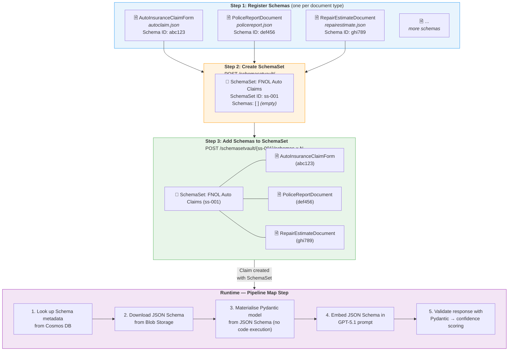
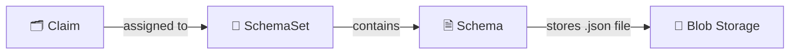
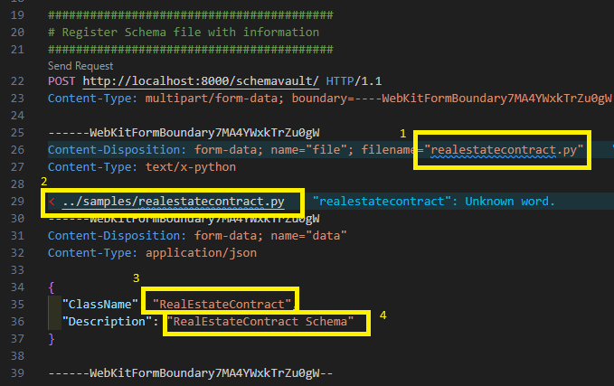

# Customizing Schema and Data

## How to Use Your Own Data

Files processed by the solution are mapped and transformed into **schemas** — JSON Schema documents that represent a standardized output for each document type. For example, the accelerator includes an `AutoInsuranceClaimForm` schema with fields like `policy_number`, `date_of_loss`, and `vehicle_information`.

Using AI, the processing pipeline extracts content from each document (text, images, tables), then maps the extracted data into the schema fields using GPT-5.1 with structured JSON output — field descriptions in the schema act as extraction guidance for the LLM.

Schemas need to be created specific to your business and domain requirements. A lot of times schemas may be generally common across industries, but this allows for variations specific to your use case.

## Schema & SchemaSet Structure

Before processing documents, schemas must be **registered** in the system and grouped into **schema sets**. The diagram below shows the three-step preparation flow and how schemas are used at runtime:



### Data Model



- **Schema** — one per document type. Metadata in Cosmos DB, `.json` schema file in Blob Storage.
- **SchemaSet** — a named group that holds references to one or more Schemas. Assigned to a Claim at creation time.
- A Schema can belong to multiple SchemaSets or none at all.

---

## Step 1: Create a JSON Schema Document

A new JSON Schema document needs to be created that defines the schema as a declarative description of your document type.

> **Schema Folder:** [../src/ContentProcessorAPI/samples/schemas/](../src/ContentProcessorAPI/samples/schemas/) — All schema JSON files should be placed into this folder

**Sample Schemas:** The accelerator ships with 4 sample schemas — use any as a starting template:

| Schema                    | File                                                                              | Class Name                      | Auto-registered |
| ------------------------- | --------------------------------------------------------------------------------- | ------------------------------- | --------------- |
| Auto Insurance Claim Form | [autoclaim.json](../src/ContentProcessorAPI/samples/schemas/autoclaim.json)             | `AutoInsuranceClaimForm`        | ✅               |
| Police Report             | [policereport.json](../src/ContentProcessorAPI/samples/schemas/policereport.json)       | `PoliceReportDocument`          | ✅               |
| Repair Estimate           | [repairestimate.json](../src/ContentProcessorAPI/samples/schemas/repairestimate.json)   | `RepairEstimateDocument`        | ✅               |
| Damaged Vehicle Image     | [damagedcarimage.json](../src/ContentProcessorAPI/samples/schemas/damagedcarimage.json) | `DamagedVehicleImageAssessment` | ✅               |

> **Note:** All 4 schemas are automatically registered during deployment (via `azd up` or the `register_schema.py` script) and grouped into the **"Auto Claim"** schema set.

Duplicate one of these files and update with fields that represent your document type.

> **Tip:** You can use GitHub Copilot to generate a schema. Example prompt:
> 
> *Generate a JSON Schema (Draft 2020-12) based on the following autoclaim.json schema definition. The generated schema should be called "Freight Shipment Bill of Lading". Please define the properties based on standard bill of lading documents in the logistics industry.*

### Schema Document Structure

Each schema `.json` file must be a JSON Schema (Draft 2020-12) with
`"type": "object"` at the root and a `"properties"` block. Example:

```json
{
  "$schema": "https://json-schema.org/draft/2020-12/schema",
  "title": "MyDocumentSchema",
  "description": "Top-level description of the document type.",
  "type": "object",
  "properties": {
    "some_field": {
      "type": ["string", "null"],
      "description": "What this field represents, e.g. policy number"
    },
    "sub_entity": {
      "$ref": "#/$defs/SubModel"
    }
  },
  "$defs": {
    "SubModel": {
      "title": "SubModel",
      "description": "Description of this sub-entity — used as LLM context.",
      "type": "object",
      "properties": {
        "field_name": {
          "type": ["string", "null"],
          "description": "What this field represents, e.g. Consignee company name"
        }
      }
    }
  }
}
```

### Key Rules

| Element                  | Requirement                                                                                                                                                                  |
| ------------------------ | ---------------------------------------------------------------------------------------------------------------------------------------------------------------------------- |
| **Root type**            | Must be `"type": "object"` with a `"properties"` block                                                                                                                       |
| **Field descriptions**   | Every property must have a `"description"` — this is the prompt text the LLM uses for extraction. Include examples for better accuracy (e.g., `"Date of loss, e.g. 01/15/2026"`) |
| **Optional vs Required** | Use `["string", "null"]` for fields that may not be present in every document; list required keys in the root `"required"` array if any                                       |
| **Sub-objects**          | Define reusable nested types under `"$defs"` and reference them via `"$ref": "#/$defs/<Name>"`                                                                                |
| **Class name**           | Use a top-level `"title"` field; this becomes `ClassName` in the Schema Vault. If absent, the request body's `ClassName` (or filename) is used                                |
| **Top-level description**| Include a `"description"` — it's used as context during mapping                                                                                                              |

---

## Step 2: Register Schemas

After creating your `.json` schema files, register each schema in the system. Registration uploads the file to Blob Storage and stores metadata in Cosmos DB.

### Option A: Register via API (individual)

**Endpoint:** `POST /schemavault/` (multipart/form-data)

| Part          | Type        | Description                                                       |
| ------------- | ----------- | ----------------------------------------------------------------- |
| `schema_info` | JSON string | `{"ClassName": "MyDocumentSchema", "Description": "My Document"}` |
| `file`        | File upload | The `.json` JSON Schema file (max 1 MB)                           |

Example using the REST Client extension:

> **Note:** Install the [REST Client VSCode extension](https://marketplace.visualstudio.com/items?itemName=humao.rest-client) to execute `.http` files directly in VS Code.

> **Sample requests:** [../src/ContentProcessorAPI/test_http/invoke_APIs.http](../src/ContentProcessorAPI/test_http/invoke_APIs.http)

The response returns a Schema `Id` — **save this** for Step 3.

> 

### Option B: Register via script (batch)

> **Note:** Default sample schemas are registered when you run the post-deployment script manually (see Deployment Guide Step 5.1). Run this script again whenever you add or update schemas.

For bulk registration, use the provided script with a JSON manifest. The script performs three steps automatically:
1. **Registers** individual schema files via `/schemavault/`
2. **Creates** a schema set via `/schemasetvault/`
3. **Adds** each registered schema into the schema set

**Manifest file** ([schema_info.json](../src/ContentProcessorAPI/samples/schemas/schema_info.json)):
```json
{
  "schemas": [
    { "File": "autoclaim.json",       "ClassName": "AutoInsuranceClaimForm",       "Description": "Auto Insurance Claim Form" },
    { "File": "damagedcarimage.json", "ClassName": "DamagedVehicleImageAssessment","Description": "Damaged Vehicle Image Assessment" },
    { "File": "policereport.json",    "ClassName": "PoliceReportDocument",         "Description": "Police Report Document" },
    { "File": "repairestimate.json",  "ClassName": "RepairEstimateDocument",       "Description": "Repair Estimate Document" }
  ],
  "schemaset": {
    "Name": "Auto Claim",
    "Description": "Claim schema set for auto claims processing"
  }
}
```

**Run the script:**
```bash
cd src/ContentProcessorAPI/samples/schemas
python register_schema.py <API_BASE_URL> schema_info.json
```

The script checks for existing schemas and schema sets to avoid duplicates, and outputs the registered Schema IDs and Schema Set ID.

### Schema API Reference

| Method   | Endpoint                            | Purpose                                  |
| -------- | ----------------------------------- | ---------------------------------------- |
| `GET`    | `/schemavault/`                     | List all registered schemas              |
| `POST`   | `/schemavault/`                     | Register a new schema (multipart upload) |
| `PUT`    | `/schemavault/`                     | Update an existing schema                |
| `DELETE` | `/schemavault/`                     | Delete a schema by ID                    |
| `GET`    | `/schemavault/schemas/{schema_id}` | Get a schema by ID (includes `.json` file) |

---

## Step 3: Create SchemaSet and Add Schemas

A **SchemaSet** groups your registered schemas together for claim processing. When a claim is created, it is assigned a SchemaSet — the Web UI presents the schemas within the set as available document types for upload.

### 3a. Create a SchemaSet

**Endpoint:** `POST /schemasetvault/`

```json
{
  "Name": "FNOL Auto Claims",
  "Description": "Schemas for auto insurance FNOL claim processing"
}
```

The response returns a SchemaSet `Id` — use this in the next step.

### 3b. Add Schemas to the SchemaSet

**Endpoint:** `POST /schemasetvault/{schemaset_id}/schemas`

For each schema registered in Step 2, add it to the set:

```json
{
  "SchemaId": "abc123"
}
```

Repeat for each schema. The SchemaSet now holds references to all your document type schemas.

### SchemaSet API Reference

| Method   | Endpoint                                             | Purpose                    |
| -------- | ---------------------------------------------------- | -------------------------- |
| `GET`    | `/schemasetvault/`                                   | List all schema sets       |
| `POST`   | `/schemasetvault/`                                   | Create a new schema set    |
| `GET`    | `/schemasetvault/{schemaset_id}`                     | Get a schema set by ID     |
| `DELETE` | `/schemasetvault/{schemaset_id}`                     | Delete a schema set        |
| `GET`    | `/schemasetvault/{schemaset_id}/schemas`             | List schemas in a set      |
| `POST`   | `/schemasetvault/{schemaset_id}/schemas`             | Add a schema to a set      |
| `DELETE` | `/schemasetvault/{schemaset_id}/schemas/{schema_id}` | Remove a schema from a set |

---

## How Schemas Are Used at Runtime

Once schemas are registered and grouped into a SchemaSet, the pipeline uses them automatically during the **Map** step:

1. **Schema lookup** — The Map handler reads the `Schema_Id` from the processing queue message, then fetches metadata from Cosmos DB
2. **Schema materialisation** — Downloads the JSON Schema document from Blob Storage and builds a Pydantic model from it in memory (no code execution)
3. **JSON Schema generation** — Calls `model_json_schema()` on the materialised model to produce the schema with all field descriptions
4. **LLM extraction** — Embeds the JSON Schema into the GPT-5.1 system prompt with `response_format` for structured JSON output (temperature=0.1 for deterministic results)
5. **Validation & scoring** — Parses the GPT response back into the Pydantic model, then computes per-field confidence scores using log-probabilities

This means your field descriptions in the schema **directly influence extraction quality** — write clear, specific descriptions with examples for best results.

---

## Authoring Schemas as JSON

The schema vault accepts **JSON Schema** documents (Draft 2020-12) only.
JSON schemas are treated strictly as data: the worker parses them and
materialises a Pydantic model in memory without executing any uploaded
code, eliminating an entire class of remote-code-execution risk in the
schema-management path. The legacy executable `.py` format has been
removed; uploads of `.py` files are rejected with HTTP 415.

### Format requirements

| | JSON Schema |
| --- | --- |
| Format | Declarative JSON document |
| Worker behaviour | Parses JSON, builds model in memory |
| Authoring | Pydantic-compatible JSON |
| Side-effects on import | Impossible |

### Upload via API

`POST /schemavault/` accepts JSON Schema documents. Send the file with
`Content-Type: application/json`:

```http
POST /schemavault/
Content-Type: multipart/form-data
- data: { "ClassName": "InvoiceSchema", "Description": "Invoice extraction" }
- file: invoice.json   (application/json)
```

When uploading JSON:

- The schema must be a JSON object with `"type": "object"` and a
  `"properties"` block.
- The schema's `title` (if present) becomes the `ClassName` recorded in
  Cosmos. If the JSON has no `title`, the request body's `ClassName` is
  used as a fallback.
- The schema must be ≤ 1 MB.

### Limitations

JSON schemas are pure data. They cannot carry custom validation logic
(e.g. Pydantic `field_validator`). For most extraction schemas this is
not a limitation — the existing samples don't use custom validators.
If you need imperative validation, implement it downstream after the
pipeline extracts the data.


- [Modifying System Processing Prompts](./CustomizeSystemPrompts.md) — Customize extraction and mapping prompts
- [Gap Analysis Ruleset Guide](./GapAnalysisRulesetGuide.md) — Define gap rules that reference your document types
- [Processing Pipeline Approach](./ProcessingPipelineApproach.md) — 4-stage extraction pipeline (Extract → Map → Evaluate → Save)
- [API Documentation](./API.md) — Full API endpoint reference
- [Claim Processing Workflow](./ClaimProcessWorkflow.md) — End-to-end workflow architecture

