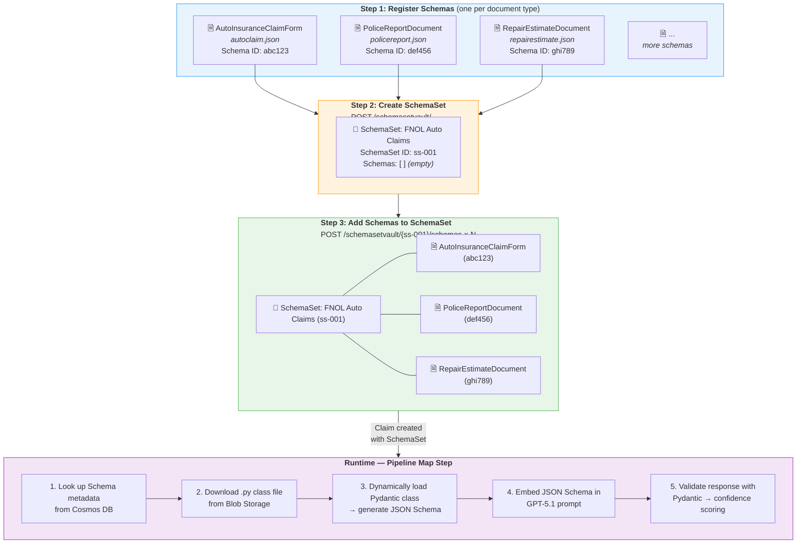
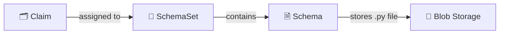

# Customizing Schema and Data

## How to Use Your Own Data

Files processed by the solution are mapped and transformed into **schemas** — strongly typed Pydantic class definitions that represent a standardized output for each document type. For example, the accelerator includes an `AutoInsuranceClaimForm` schema with fields like `policy_number`, `date_of_loss`, and `vehicle_information`.

Using AI, the processing pipeline extracts content from each document (text, images, tables), then maps the extracted data into the schema fields using GPT-5.1 with structured JSON output — field descriptions in the schema class act as extraction guidance for the LLM.

Schemas need to be created specific to your business and domain requirements. A lot of times schemas may be generally common across industries, but this allows for variations specific to your use case.

## Schema & SchemaSet Structure

Before processing documents, schemas must be **registered** in the system and grouped into **schema sets**. The diagram below shows the three-step preparation flow and how schemas are used at runtime:



### Data Model



- **Schema** — one per document type. Metadata in Cosmos DB, `.py` class file in Blob Storage.
- **SchemaSet** — a named group that holds references to one or more Schemas. Assigned to a Claim at creation time.
- A Schema can belong to multiple SchemaSets or none at all.

---

## Step 1: Create Schema Class (.py)

A new class needs to be created that defines the schema as a strongly typed Python class inheriting from Pydantic `BaseModel`.

> **Schema Folder:** [/src/ContentProcessorAPI/samples/schemas/](/src/ContentProcessorAPI/samples/schemas/) — All schema classes should be placed into this folder

**Sample Schemas:** The accelerator ships with 4 sample schemas — use any as a starting template:

| Schema                    | File                                                                              | Class Name                      | Auto-registered |
| ------------------------- | --------------------------------------------------------------------------------- | ------------------------------- | --------------- |
| Auto Insurance Claim Form | [autoclaim.json](/src/ContentProcessorAPI/samples/schemas/autoclaim.json)             | `AutoInsuranceClaimForm`        | ✅               |
| Police Report             | [policereport.json](/src/ContentProcessorAPI/samples/schemas/policereport.json)       | `PoliceReportDocument`          | ✅               |
| Repair Estimate           | [repairestimate.json](/src/ContentProcessorAPI/samples/schemas/repairestimate.json)   | `RepairEstimateDocument`        | ✅               |
| Damaged Vehicle Image     | [damagedcarimage.json](/src/ContentProcessorAPI/samples/schemas/damagedcarimage.json) | `DamagedVehicleImageAssessment` | ✅               |

> **Note:** All 4 schemas are automatically registered during deployment (via `azd up` or the `register_schema.py` script) and grouped into the **"Auto Claim"** schema set.

Duplicate one of these files and update with a class definition that represents your document type.

> **Tip:** You can use GitHub Copilot to generate a schema. Example prompt:
> 
> *Generate a Schema Class based on the following autoclaim.py schema definition, which has been built and derived from Pydantic BaseModel class. The generated Schema Class should be called "Freight Shipment Bill of Lading" schema file. Please define the entities based on standard bill of lading documents in the logistics industry.*

### Class Structure

Each schema `.py` file must include:

```python
from pydantic import BaseModel, Field
from typing import List, Optional

class SubModel(BaseModel):
    """Description of this sub-entity — used as LLM context."""
    
    field_name: Optional[str] = Field(
        description="What this field represents, e.g. Consignee company name"
    )

class MyDocumentSchema(BaseModel):
    """Top-level description of the document type."""
    
    some_field: Optional[str] = Field(description="...")
    sub_entity: Optional[SubModel] = Field(description="...")
    
    @staticmethod
    def example() -> "MyDocumentSchema":
        """Returns an empty instance of this schema."""
        return MyDocumentSchema(some_field="", sub_entity=SubModel.example())
    
    @staticmethod
    def from_json(json_str: str) -> "MyDocumentSchema":
        """Creates an instance from a JSON string."""
        return MyDocumentSchema.model_validate_json(json_str)
    
    def to_dict(self) -> dict:
        """Converts this instance to a dictionary."""
        return self.model_dump()
```

### Key Rules

| Element                  | Requirement                                                                                                                                                                  |
| ------------------------ | ---------------------------------------------------------------------------------------------------------------------------------------------------------------------------- |
| **Inheritance**          | All classes must inherit from `pydantic.BaseModel`                                                                                                                           |
| **Field descriptions**   | Every field must have a `description=` — this is the prompt text the LLM uses for extraction. Include examples for better accuracy (e.g., `"Date of loss, e.g. 01/15/2026"`) |
| **Optional vs Required** | Use `Optional[str]` for fields that may not be present in every document                                                                                                     |
| **Subclasses**           | Use nested `BaseModel` classes for complex entities (address, line items, etc.)                                                                                              |
| **Required methods**     | `example()`, `from_json()`, `to_dict()` — all three must be present                                                                                                          |
| **Class docstring**      | Include a description — it's used as context during mapping                                                                                                                  |

---

## Step 2: Register Schemas

After creating your `.py` class files, register each schema in the system. Registration uploads the class file to Blob Storage and stores metadata in Cosmos DB.

### Option A: Register via API (individual)

**Endpoint:** `POST /schemavault/` (multipart/form-data)

| Part          | Type        | Description                                                       |
| ------------- | ----------- | ----------------------------------------------------------------- |
| `schema_info` | JSON string | `{"ClassName": "MyDocumentSchema", "Description": "My Document"}` |
| `file`        | File upload | The `.py` class file (max 1 MB)                                   |

Example using the REST Client extension:

> **Note:** Install the [REST Client VSCode extension](https://marketplace.visualstudio.com/items?itemName=humao.rest-client) to execute `.http` files directly in VS Code.

> **Sample requests:** [/src/ContentProcessorAPI/test_http/invoke_APIs.http](/src/ContentProcessorAPI/test_http/invoke_APIs.http)

The response returns a Schema `Id` — **save this** for Step 3.

> 

### Option B: Register via script (batch)

> **Note:** The default sample schemas are registered **automatically** during `azd up` via the post-provisioning hook. You only need to run the script manually if you are adding custom schemas or if automatic registration was skipped.

For bulk registration, use the provided script with a JSON manifest. The script performs three steps automatically:
1. **Registers** individual schema files via `/schemavault/`
2. **Creates** a schema set via `/schemasetvault/`
3. **Adds** each registered schema into the schema set

**Manifest file** ([schema_info.json](/src/ContentProcessorAPI/samples/schemas/schema_info.json)):
```json
{
  "schemas": [
    { "File": "autoclaim.json",       "ClassName": "AutoInsuranceClaimForm",       "Description": "Auto Insurance Claim Form" },
    { "File": "damagedcarimage.json", "ClassName": "DamagedVehicleImageAssessment","Description": "Damaged Vehicle Image Assessment" },
    { "File": "policereport.json",    "ClassName": "PoliceReportDocument",         "Description": "Police Report Document" },
    { "File": "repairestimate.json",  "ClassName": "RepairEstimateDocument",       "Description": "Repair Estimate Document" }
  ],
  "schemaset": {
    "Name": "Auto Claim",
    "Description": "Claim schema set for auto claims processing"
  }
}
```

**Run the script:**
```bash
cd src/ContentProcessorAPI/samples/schemas
python register_schema.py <API_BASE_URL> schema_info.json
```

The script checks for existing schemas and schema sets to avoid duplicates, and outputs the registered Schema IDs and Schema Set ID.

### Schema API Reference

| Method   | Endpoint                            | Purpose                                  |
| -------- | ----------------------------------- | ---------------------------------------- |
| `GET`    | `/schemavault/`                     | List all registered schemas              |
| `POST`   | `/schemavault/`                     | Register a new schema (multipart upload) |
| `PUT`    | `/schemavault/`                     | Update an existing schema                |
| `DELETE` | `/schemavault/`                     | Delete a schema by ID                    |
| `GET`    | `/schemavault/schemas/{schema_id}` | Get a schema by ID (includes `.py` file)  |

---

## Step 3: Create SchemaSet and Add Schemas

A **SchemaSet** groups your registered schemas together for claim processing. When a claim is created, it is assigned a SchemaSet — the Web UI presents the schemas within the set as available document types for upload.

### 3a. Create a SchemaSet

**Endpoint:** `POST /schemasetvault/`

```json
{
  "Name": "FNOL Auto Claims",
  "Description": "Schemas for auto insurance FNOL claim processing"
}
```

The response returns a SchemaSet `Id` — use this in the next step.

### 3b. Add Schemas to the SchemaSet

**Endpoint:** `POST /schemasetvault/{schemaset_id}/schemas`

For each schema registered in Step 2, add it to the set:

```json
{
  "SchemaId": "abc123"
}
```

Repeat for each schema. The SchemaSet now holds references to all your document type schemas.

### SchemaSet API Reference

| Method   | Endpoint                                             | Purpose                    |
| -------- | ---------------------------------------------------- | -------------------------- |
| `GET`    | `/schemasetvault/`                                   | List all schema sets       |
| `POST`   | `/schemasetvault/`                                   | Create a new schema set    |
| `GET`    | `/schemasetvault/{schemaset_id}`                     | Get a schema set by ID     |
| `DELETE` | `/schemasetvault/{schemaset_id}`                     | Delete a schema set        |
| `GET`    | `/schemasetvault/{schemaset_id}/schemas`             | List schemas in a set      |
| `POST`   | `/schemasetvault/{schemaset_id}/schemas`             | Add a schema to a set      |
| `DELETE` | `/schemasetvault/{schemaset_id}/schemas/{schema_id}` | Remove a schema from a set |

---

## How Schemas Are Used at Runtime

Once schemas are registered and grouped into a SchemaSet, the pipeline uses them automatically during the **Map** step:

1. **Schema lookup** — The Map handler reads the `Schema_Id` from the processing queue message, then fetches metadata from Cosmos DB
2. **Dynamic class loading** — Downloads the `.py` file from Blob Storage and dynamically loads the Pydantic class
3. **JSON Schema generation** — Calls `model_json_schema()` on the class to produce a full JSON Schema with all field descriptions
4. **LLM extraction** — Embeds the JSON Schema into the GPT-5.1 system prompt with `response_format` for structured JSON output (temperature=0.1 for deterministic results)
5. **Validation & scoring** — Parses the GPT response back into the Pydantic class, then computes per-field confidence scores using log-probabilities

This means your field descriptions in the schema class **directly influence extraction quality** — write clear, specific descriptions with examples for best results.

---

## Authoring Schemas as JSON (recommended)

The schema vault now also accepts **JSON Schema** documents (Draft 2020-12)
in addition to the legacy executable `.py` format. JSON schemas are treated
strictly as data: the worker parses them and materialises a Pydantic model
in memory without executing any uploaded code, eliminating an entire class
of remote-code-execution risk in the schema-management path.

### Why JSON?

| | Legacy `.py` | JSON Schema |
| --- | --- | --- |
| Format | Executable Pydantic class | Declarative JSON document |
| Worker behaviour | Imports and runs uploaded Python | Parses JSON, builds model in memory |
| Authoring | Hand-written Python | Pydantic-compatible JSON |
| Side-effects on import | Possible | Impossible |

Both formats are accepted today; JSON is the recommended path for new
schemas and is required to be opted into per upload by using a `.json`
file extension.

### Authoring with the conversion helper

If you have an existing Pydantic-based `.py` schema, the repo ships a
helper that emits the equivalent JSON Schema:

```bash
python scripts/py_schema_to_json.py \
    src/ContentProcessorAPI/samples/schemas/autoclaim.py \
    AutoInsuranceClaimForm
```

This writes `autoclaim.json` next to the source file. Under the hood it
calls `Model.model_json_schema()` from Pydantic v2 — the same call the
worker uses today to build the LLM prompt. The output is therefore
already aligned with the contract the pipeline expects.

The accelerator ships a golden conversion of the auto-claim sample at
[/src/ContentProcessorAPI/samples/schemas/autoclaim.json](/src/ContentProcessorAPI/samples/schemas/autoclaim.json)
that you can reference.

### Upload via API

`POST /schemavault/` accepts either format. For JSON, send the file as
`application/json`:

```http
POST /schemavault/
Content-Type: multipart/form-data
- data: { "ClassName": "InvoiceSchema", "Description": "Invoice extraction" }
- file: invoice.json   (application/json)
```

When uploading JSON:

- The schema must be a JSON object with `"type": "object"` and a
  `"properties"` block.
- The schema's `title` (if present) becomes the `ClassName` recorded in
  Cosmos. If the JSON has no `title`, the request body's `ClassName` is
  used as a fallback.
- Two project-specific extension keywords are accepted:
  - `x-cps-extract-prompt` — optional override for the LLM extraction
    prompt for that field.
  - `x-cps-required-on-save` — marks a field that must be present in
    the LLM output before persistence.
  Any other `x-…` keyword is rejected.
- The schema must be ≤ 1 MB.

### Constraints relative to the legacy Python schemas

JSON schemas are pure data. They cannot carry custom validation logic
written in Python (e.g. `field_validator`). For most extraction
schemas this is not a limitation — the existing samples don't use
custom validators — but if you depend on imperative validation, keep
authoring those schemas in Python locally and run the resulting JSON
through the API.


- [Modifying System Processing Prompts](./CustomizeSystemPrompts.md) — Customize extraction and mapping prompts
- [Gap Analysis Ruleset Guide](./GapAnalysisRulesetGuide.md) — Define gap rules that reference your document types
- [Processing Pipeline Approach](./ProcessingPipelineApproach.md) — 4-stage extraction pipeline (Extract → Map → Evaluate → Save)
- [API Documentation](./API.md) — Full API endpoint reference
- [Claim Processing Workflow](./ClaimProcessWorkflow.md) — End-to-end workflow architecture

