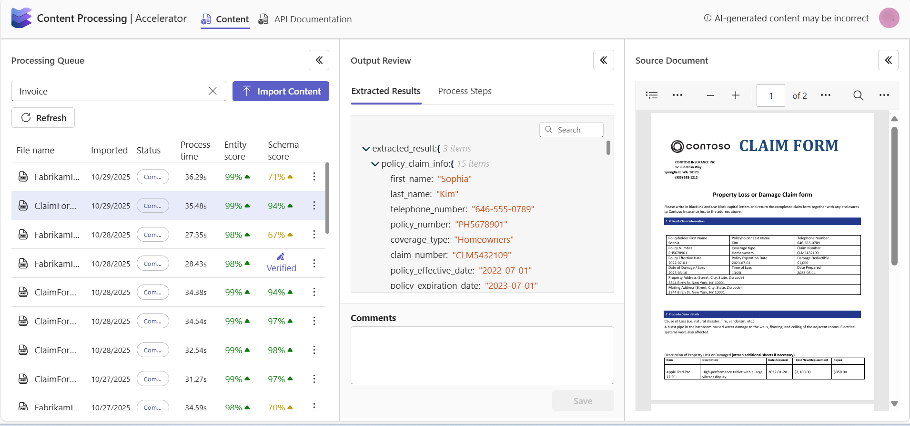

# Sample Workflow

To help you get started, here’s a **sample process** you can follow in the app.

## **Process**

> Note: Download sample data files for **Invoices** and **Property Claims** from [here](../src/ContentProcessorAPI/samples).

### **API Documentation**

- Click on **API Documentation** to view and explore the available API endpoints and their details.

### **Upload**

_Sample Qperations:_

- Select the **Schema** under the Processing Queue pane.
- Click on the **Import Content** button.
- Choose a file from the downloaded list for data extraction corresponding to the **Schema** selected.
- Click the **Upload** button.

### **Review and Process**

_Sample Qperation:_

- Once the file status is marked as completed and click on the file.
- Once the batch Processing is done, file is ready to review and the extracted data is displayed in the **Output Review** pane and corresponding file is visible in the **Source Document** pane.
- Edit any incorrect data in the JSON which is shown in the **Output Review** pane under **Extracted Results** tab.
- Add notes under the **Comments** and save the changes by clicking on the **Save** button
- You can view the process steps in the **Output Review** pane under the **Process Steps** tab and expand the extract, Map, and evaluate sections to see the outputs from each process step.

 
  
### **Delete**

_Sample operation:_

- Click the **three-dot menu** at the end of the row to expand options, then select **Delete** to remove the item.
  
This structured approach ensures that users can efficiently extract key information, and organize structured outputs for easy search and analysis.
