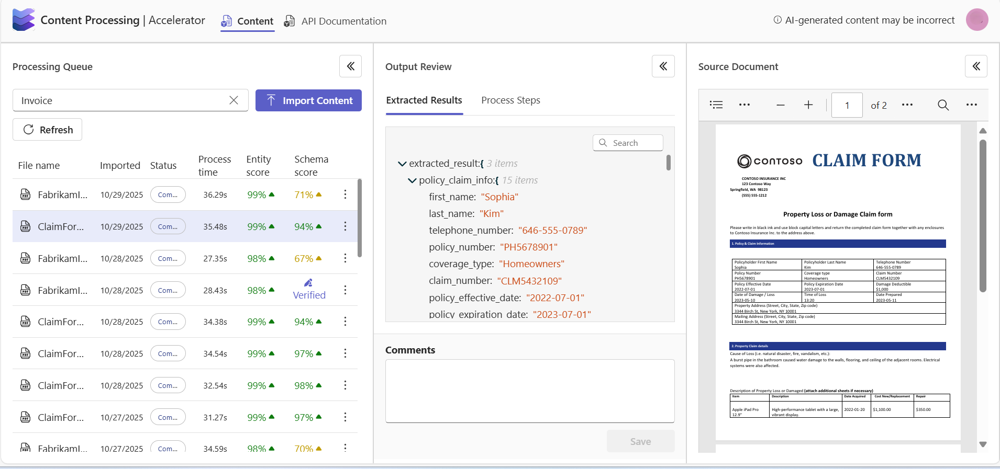

<< To be updated later with more details and screenshots >>
# Sample Workflow

To help you get started, here’s a **sample process** you can follow in the app.

## **Workflow 1: Single Document Processing**

> Note: Download sample data files from the [samples directory](../src/ContentProcessorAPI/samples) — use the `autoclaim/` and `autoclaim_gap1/` folders for auto claim documents.

### **API Documentation**

- Click on **API Documentation** to view and explore the available API endpoints and their details.

### **Upload**

  > Note: Average response time is 01 minute.

_Sample Operations:_

- Select the **Schema** under the Processing Queue pane.
- Click on the **Import Content** button.
- Choose a file from the downloaded list for data extraction corresponding to the **Schema** selected.
- Click the **Upload** button.

### **Review and Process**

_Sample Operation:_

- Once the file status is marked as completed, click on the file.
- Once the batch processing is done, the file is ready to review and the extracted data is displayed in the **Output Review** pane and corresponding file is visible in the **Source Document** pane.
- Edit any incorrect data in the JSON which is shown in the **Output Review** pane under **Extracted Results** tab.
- Add notes under the **Comments** and save the changes by clicking on the **Save** button.
- You can view the process steps in the **Output Review** pane under the **Process Steps** tab and expand the extract, Map, and evaluate sections to see the outputs from each process step.

 
  
### **Delete**

_Sample operation:_

- Click the **three-dot menu** at the end of the row to expand options, then select **Delete** to remove the item.

---

## **Workflow 2: Claim Batch Processing**

The claim batch processing workflow allows you to upload multiple files to a claim and have them processed with automated content extraction, summarization, and gap analysis. The processing flow is:

> **Web UI** → Content Process API (workflow endpoints) → Content Process Workflow (Agent Framework) → Content Process API (content processor endpoints) → Content Processor (4-stage pipeline)

For the full technical details, see [Claim Processing Workflow](./ClaimProcessWorkflow.md).

> Note: Additional sample data for claim processing is available in the `autoclaim/` and `autoclaim_gap1/` folders within the [samples directory](../src/ContentProcessorAPI/samples).

### **1. Upload Multiple Files to a Claim**

_Sample Operations:_

1. Create a **Schema Set** (collection) that groups the schemas relevant to your claim type via the API. See [Schema Sets](./CustomizeSchemaData.md#schema-sets-collections) for details.
2. Create a new **Claim** by calling the Claim Processor API with the schema set ID. This creates a claim container in blob storage.
3. **Upload files** to the claim — add each document with its corresponding schema assignment.

### **2. Start Claim Processing**

_Sample Operations:_

1. Submit the claim for processing via the API. Behind the scenes:
   - The **Claim Processor Workflow** picks up the request from the queue.
   - **Document Processing** – The workflow invokes the Content Processor (via the API) for _each_ document in the claim, running the full 4-stage extraction pipeline (Extract → Map → Evaluate → Save).
   - **Summarizing** – AI generates a consolidated summary across all processed documents.
   - **Gap Analysis** – AI identifies missing information and inconsistencies.
2. Monitor the claim status as it progresses: `Pending` → `Processing` → `Summarizing` → `GapAnalysis` → `Completed`.

### **3. Review Claim Results**

_Sample Operations:_

- Once the claim status is marked as **Completed**, retrieve the claim details via the API.
- Review individual **content processing results** with extraction and schema confidence scores.
- Review the AI-generated **Summary** for a consolidated view across all claim documents.
- Review the **Gap Analysis** results to identify missing or inconsistent information.
- Add comments and annotations to the claim record.

For full API endpoint details, see the [Claim Processor API documentation](./API.md#claim-processor).

---

This structured approach ensures that users can efficiently process single documents or multi-document claims, extract key information, generate summaries, and identify gaps for comprehensive review and analysis.
