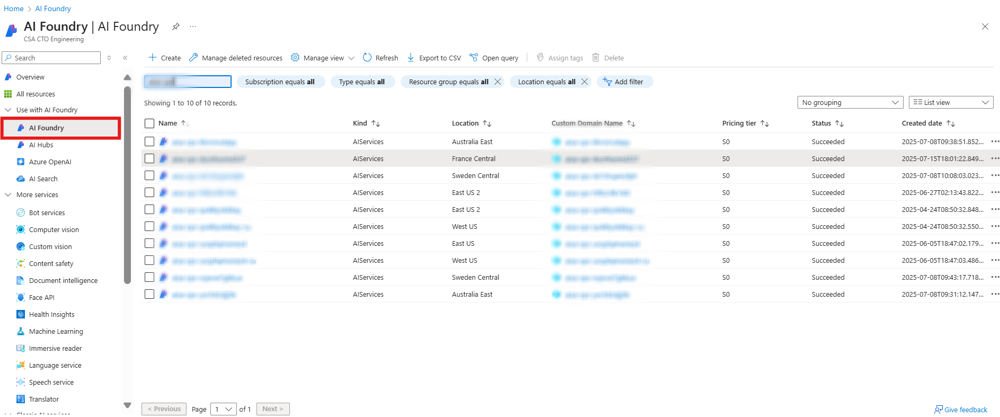
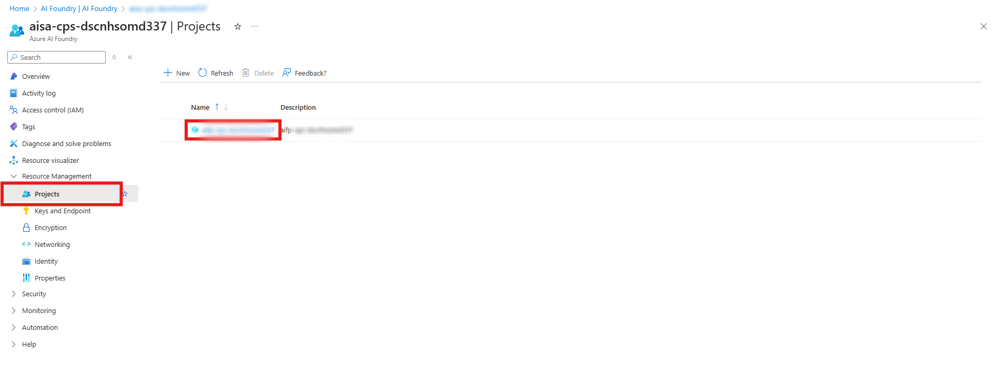
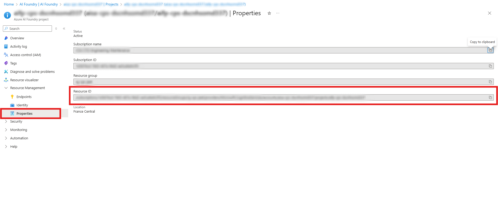

[← Back to *DEPLOYMENT* guide](./DeploymentGuide.md#deployment-options--steps)

# Reusing an Existing Azure AI Foundry Project
To configure your environment to use an existing Azure AI Foundry Project, follow these steps:

> **⚠️ Region requirement**
>
> The existing Foundry project must reside in a region that supports **both** the GPT model deployed by this accelerator (default `gpt-5.1` with `GlobalStandard` deployment type) **and** Azure AI Content Understanding (GA).<br>
> Supported regions: `australiaeast`, `eastus`, `eastus2`, `northcentralus`, `southcentralus`, `swedencentral`, `switzerlandnorth`, `westeurope`, `westus`, `westus2`, `westus3`.<br>
> If the existing project is in a different region, deployment will fail or the application will not work correctly.

---
### 1. Go to Azure Portal
Go to https://portal.azure.com

### 2. Search for Azure AI Foundry
In the search bar at the top, type "Azure AI Foundry" and click on it. Then select the Foundry service instance where your project exists.



### 3. Navigate to Projects under Resource Management
On the left sidebar of the Foundry service blade:

- Expand the Resource Management section
- Click on Projects (this refers to the active Foundry project tied to the service)

### 4. Click on the Project
From the Projects view: Click on the project name to open its details

    Note: You will see only one project listed here, as each Foundry service maps to a single project in this accelerator



### 5. Copy Resource ID
In the left-hand menu of the project blade: 

- Click on Properties under Resource Management
- Locate the Resource ID field
- Click on the copy icon next to the Resource ID value



### 6. Set the Foundry Project Resource ID in Your Environment
Run the following command in your terminal
```bash
azd env set AZURE_EXISTING_AIPROJECT_RESOURCE_ID '<Existing Foundry Project Resource ID>'
```
Replace `<Existing Foundry Project Resource ID>` with the value obtained from Step 5.

### 7. Continue Deployment
Proceed with the next steps in the [deployment guide](./DeploymentGuide.md#deployment-options--steps).
